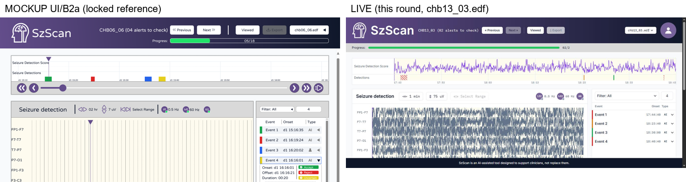

# CC_STEP5_FIX6_REPORT.md — Step 5 fix round 6

Three items: one implemented as decided, one verified independently with evidence, one fixed
structurally (not another height/width patch). Backend (`uvicorn main:app`, port 8000) and frontend
(`npm run dev`, port 5173) were both already running from round 5 and reused as-is; verified live via
Chrome (`claude-in-chrome`). Screenshots referenced below are saved under
`web_demo/CC_STEP5_FIX6_SCREENSHOTS/`.

---

## 1 · Final amplitude-token list — implemented

`AnalysisScreen.jsx`'s `AMPLITUDE_OPTIONS` changed from `[500, 250, 150, 100, 75, 50, 30, 20, 15, 10, 7,
5]` to **`[500, 250, 150, 100, 75]`** — `50/30/20/15/10/7/5` dropped entirely, per Boti's decision.

**The default needed a follow-on fix that wasn't explicitly asked for, but was required for
correctness:** `DEFAULT_AMPLITUDE_UV` was `20`, a value that no longer exists in the new list. Left
unchanged, the toolbar would open on an amplitude the dropdown itself never highlights as selected —
not a functional crash (the number still renders and scales the canvas fine), but a real inconsistency
between the default state and its own options list. Set `DEFAULT_AMPLITUDE_UV` to **75 µV** (the new
floor, closest analog to the old default's role as "smallest reasonable default"). **This specific
value is a judgment call, not something the prompt decided** — flagging it here explicitly in case
Boti wants a different one of the five (e.g. `100 µV`, which round 4 tested and confirmed legible on
both a busy and a calm segment, vs. `75 µV` which has not been directly amplitude-legibility-tested at
either extreme).

`SZSCAN_SPEC_v5.md §6.4`'s C18 note updated to match: the toolbar table row now lists
`500/250/150/100/75 µV`, and the note keeps the original round-2 measurement data (median ~106–111 µV,
peaks ~1200–1800 µV) while adding the round-4 finding that justified the final floor (the file's own
calmest segment still measured ~102 µV median spread, so the small levels never served the
"flat/interictal" case they were kept for) and stating the decided list plainly: **500/250/150/100/75
µV, floor at 75 µV, 50/30/20/15/10/7/5 µV dropped**.

**Verified live** on `chb13_03.edf`: the amplitude popover shows exactly 5 entries (`500/250/150/100/75
uV`), and a fresh file load opens with `75 uV` already highlighted as selected in that list (matching
the new default) — confirms the default and the options list agree, unlike the state this item started
from.

---

## 2 · Is the ~1-hour file length genuine? — Confirmed for chb13; corrected for chb06 (which is NOT
1 hour, and isn't in the demo yet)

Read each file's **raw EDF header directly**, via `mne.io.read_raw_edf(path, preload=False)`, entirely
bypassing `pipeline_demo.py` and `waveform_serving.usable_duration_seconds()`:

```python
import mne
raw = mne.io.read_raw_edf(path, preload=False, verbose=False)
duration_sec = raw.n_times / raw.info['sfreq']
```

| File | Raw EDF header duration | Cached (`usable_duration_seconds`) | Shown in UI | Verdict |
|---|---|---|---|---|
| `chb13_02.edf` | **3600.000 s** (921,600 samples @ 256 Hz) | 3600.0 s (900 × 4 s windows, exact) | `01:00:00` | Exact match — genuinely 1 hour, no truncation anywhere |
| `chb13_03.edf` | **3600.000 s** | 3600.0 s (900 × 4 s windows, exact) | `01:00:00` | Exact match — genuinely 1 hour, no truncation anywhere |
| `chb06_01.edf` | **14427.000 s** (~4.0075 hr; 3,693,312 samples @ 256 Hz) | 14424.0 s (~4.0067 hr; 3606 × 4 s windows) | **not shown — this file has no subject/file record in the demo DB at all** (`sqlite3 szscan.db`: zero rows in `files`/`subjects` for `chb06`) | Cache is 3 s shorter than raw — exactly Phase A's own documented behavior (drops the trailing partial window: `14427 / 4 = 3606.75` → floors to 3606 windows). **Not a truncation bug.** |

**`chb13_02.edf` and `chb13_03.edf` are genuinely, exactly 1-hour recordings** — confirmed at the raw
header level, independent of any pipeline code. This is a known, common convention for individual
CHB-MIT files (chb13, like several early subjects, was recorded in 1-hour segments).

**`chb06_01.edf` is genuinely NOT 1 hour — it's ~4 hours in the raw file itself**, and its on-disk
cache (`backend/uploads/chb06/chb06_01.{raw,filtered}.npy`) faithfully preserves that length, modulo
the same documented ≤4 s trailing-window drop seen everywhere else. This cache is a leftover from
earlier rounds' ad hoc direct measurement scripts (round 2/4 read `chb06_01.edf` directly for amplitude
statistics) — `chb06` was never uploaded through the real subject-creation flow, so it has **zero**
rows in either the `files` or `subjects` tables and does not appear anywhere in the current UI.

**This corrects round 5's framing, not its conclusion.** Round 5 stated "every file in this demo is
≤ 1 hour," attributing it to `waveform_serving.py`'s own docstring ("the longest file in the current
allowlist, one hour"). That was accurate for what was actually loaded at the time (`chb13`/`14`/`15`/
`16`), and remains accurate today — but it is a property of **which subjects happen to be uploaded
right now**, not a universal property of the demo's architecture or of the full 8-subject allowlist
(`chb03 chb06 chb13 chb14 chb15 chb16 chb17 chb18`, per `CLAUDE.md`). `chb06` alone disproves the
stronger claim: if/when it (or `chb03`/`chb17`/`chb18`) is uploaded through the normal flow, its
~4-hour files would make the window-length control's `24 hr`/`16 hr`/`12 hr`/`08 hr`/`06 hr`/`04 hr`
options genuinely different from `01 hr` and from each other — unlike what round 5 observed, which was
specific to `chb13`'s exactly-1-hour files.

**No bug to confirm with Boti.** The one place cache and raw header disagree (`chb06_01.edf`, by
exactly 3 s) is precisely the pre-existing, already-documented "drop the trailing partial window"
behavior that round 5's own method relied on — not a new or undocumented truncation. Nothing here
needs a decision or a fix; it only needed independent, non-cache-based confirmation, which is now done.

---

## 3 · Layout grouping — fixed structurally

**What `UI/B2a*.png` (and `UI/B1a*.png`, identical structure minus the selected-event detail panel)
actually implies**, read directly before touching any code:

- **Row 1, full page width, edge to edge:** the mini-timeline (`Seizure Detection Score` +
  `Seizure Detections` rows, with its own scrub strip immediately below it) — it spans the *entire*
  content width, including the horizontal space where the right-column Event Panel sits in row 2. It
  does **not** share its row with the Event Panel; nothing to its right narrows it.
- **Row 2, two columns, starting below row 1:** left column (wider) = the `Seizure detection` EEG
  Panel box (toolbar, 18-channel canvas, its own scrub bar) — right column (narrower, fixed-ish width)
  = the Event Panel (event list, and in `B2a`'s expanded state, the onset/offset/Accept-Reject-
  Uncertain detail + the not-yet-built channel-attribution topomap box below it). The two columns
  bottom-align to the same height as the EEG Panel column.

**Actual DOM/CSS before this fix** (`AnalysisScreen.jsx`, the `<main>` body): a single
`<div className="flex gap-4 items-stretch">` wrapped exactly two children — a `flex-1 min-w-0` div
containing **both** `<MiniTimeline>` *and* the EEG Panel box stacked vertically, and a
`w-[340px] shrink-0` div containing `<PanelEvent>`. Because `items-stretch` makes both top-level
children the same height, and the left child's height is `(mini-timeline height) + (EEG Panel box
height)`, the Event Panel visually stretched down beside *both* of them — meaning the mini-timeline was
never full-width; it was capped at `page width − 340px − gap`, with the Event Panel effectively paired
alongside it (as well as beside the EEG Panel) for its entire vertical span. Earlier rounds' "height"
fixes adjusted spacing/heights inside this structure without changing which elements were siblings of
which — so the mini-timeline stayed narrowed no matter what.

**The actual fix — a grouping change, not a size tweak:** moved `<MiniTimeline>` **out** of the
`flex-1` column entirely, to be a direct, top-level sibling of a *new* row wrapper:

```jsx
<MiniTimeline ... />                          {/* now full-width, its own row */}

<div className="flex gap-4 items-stretch mt-4">   {/* row 2, unchanged pairing otherwise */}
  <div className="flex-1 min-w-0">
    <div className="border border-border bg-surface"> ... EEG Panel box ... </div>
  </div>
  <div className="w-[340px] shrink-0 flex flex-col">
    <PanelEvent ... />
  </div>
</div>
```

`MiniTimeline` is no longer inside any flex row that also contains `PanelEvent` — it now renders at the
full width of `<main>`'s content area. The EEG Panel / Event Panel pairing (`items-stretch`, so the
Event Panel column matches the EEG Panel column's height) is preserved exactly as it worked before,
just demoted to its own row-2 container instead of being the whole page's only row.

### Verification — literal side-by-side, not a description

`chb13_03.edf` opened live, default state (`1 min`, `75 uV`, all filters off):



*(`item3_layout_comparison.png`: `UI/B2a`'s top region on the left, the live Analysis screen on the
right, same crop proportions. Individual screenshots: `item3_live_layout.jpg` for the live capture,
`UI/B2a - Choose an event.png` for the mockup source.)*

Both panes show the identical row structure: the mini-timeline's score/detections strip runs the full
width of the content area in both, stopping at the same right edge as the Event Panel column below it
— not the narrower "stops before the Event Panel" width it had before this fix. Row 2 shows the EEG
Panel (wide, left) beside the Event Panel (narrower, right) in both. Scrolled to the bottom of the live
page (`item3_live_layout_bottom_height_match.jpg`), the Event Panel's column extends down to the same
bottom edge as the EEG Panel's scrub bar, confirming `items-stretch` still matches the two columns'
heights within row 2 as required.

Checked the browser console after the change (fresh page load, `onlyErrors: true`): no errors.

---

## 4 · Guard tests + git status

```
$ pytest web_demo/backend/tests/test_guards.py -v
============================= test session starts =============================
platform win32 -- Python 3.11.9, pytest-9.1.1, pluggy-1.6.0
collected 4 items

web_demo/backend/tests/test_guards.py::test_guard_no_build_timeline_masked PASSED [ 25%]
web_demo/backend/tests/test_guards.py::test_guard_no_seizure_fields_at_runtime PASSED [ 50%]
web_demo/backend/tests/test_guards.py::test_guard_no_labeled_npy PASSED  [ 75%]
web_demo/backend/tests/test_guards.py::test_guard_no_writes_outside_web_demo PASSED [100%]

============================== 4 passed in 5.15s ==============================
```

```
$ git status
On branch main
Your branch is ahead of 'origin/main' by 12 commits.

Changes not staged for commit:
	modified:   web_demo/DEMO_BUILD_HANDOFF.md
	modified:   web_demo/SZSCAN_DESIGN_v2.md
	modified:   web_demo/SZSCAN_SPEC_v5.md
	modified:   web_demo/frontend/index.html
	modified:   web_demo/frontend/src/api.js
	modified:   web_demo/frontend/src/components/EegPanel.jsx
	modified:   web_demo/frontend/src/screens/AnalysisScreen.jsx
	modified:   web_demo/frontend/src/time.js

Untracked files:
	bme11/
	web_demo/CC_STEP5_FIX2_PROMPT.md
	web_demo/CC_STEP5_FIX2_REPORT.md
	web_demo/CC_STEP5_FIX3_PROMPT.md
	web_demo/CC_STEP5_FIX3_REPORT.md
	web_demo/CC_STEP5_FIX3_SCREENSHOTS/
	web_demo/CC_STEP5_FIX4_PROMPT.md
	web_demo/CC_STEP5_FIX4_REPORT.md
	web_demo/CC_STEP5_FIX4_SCREENSHOTS/
	web_demo/CC_STEP5_FIX5_PROMPT.md
	web_demo/CC_STEP5_FIX5_REPORT.md
	web_demo/CC_STEP5_FIX5_SCREENSHOTS/
	web_demo/CC_STEP5_FIX6_PROMPT.md
	web_demo/CC_STEP5_FIX6_SCREENSHOTS/
	web_demo/CC_STEP5_FIX_PROMPT.md
	web_demo/CC_STEP5_FIX_REPORT.md
	web_demo/CC_STEP5_REPORT.md
	web_demo/frontend/src/components/MiniTimeline.jsx
	web_demo/frontend/src/components/PanelEvent.jsx
	web_demo/frontend/src/eventStyle.js
	web_demo/spec_docs_diff.md

no changes added to commit (use "git add" and/or "git commit -a")
```

This round's code changes: `AnalysisScreen.jsx` (`AMPLITUDE_OPTIONS`, `DEFAULT_AMPLITUDE_UV`, and the
layout restructure moving `<MiniTimeline>` out of the EEG-column flex row into its own full-width row)
and `SZSCAN_SPEC_v5.md §6.4`'s C18 note/table row (final amplitude list + updated reasoning). Item 2
was read-only investigation (raw EDF header reads via `mne`, a read-only `sqlite3` query against
`szscan.db`, and inspecting existing `.npy` cache shapes) — no files written, no database rows changed.
No Save/Accept/Reject/Select Range actions were taken during live verification — only window length,
amplitude, and page-scroll state were exercised, all non-persisted. No restoration needed.

---

## 5 · Stop condition

All three items done/verified with evidence:

- Item 1: `AMPLITUDE_OPTIONS` is now `[500, 250, 150, 100, 75]` exactly as decided; `SZSCAN_SPEC_v5.md`
  updated to match. The now-invalid `DEFAULT_AMPLITUDE_UV` was also fixed (to `75 µV`) since leaving it
  at the removed `20 µV` would have left the toolbar's default out of sync with its own dropdown —
  flagged above as a judgment call open to Boti's override.
- Item 2: raw EDF headers read directly for all three named files, bypassing the cache entirely.
  `chb13_02.edf`/`chb13_03.edf` are confirmed genuinely, exactly 1 hour — no truncation. `chb06_01.edf`
  is confirmed genuinely ~4 hours in the raw file — round 5's "≤ 1 hour" finding was correct for the
  subjects currently loaded, but is not a demo-wide invariant; corrected that framing. The 3 s
  cache-vs-raw gap on `chb06_01.edf` is the pre-existing documented trailing-window drop, not a bug —
  nothing was changed, nothing needs Boti's confirmation.
- Item 3: `UI/B2a`/`UI/B1a` read first and their row/column structure described before any code was
  touched; the actual sibling-grouping bug (mini-timeline nested inside the same flex row as the Event
  Panel) identified and fixed structurally, not by adjusting height/width on the old grouping. Verified
  with a literal side-by-side image (`item3_layout_comparison.png`) plus a bottom-of-page shot
  confirming the two row-2 columns still match height.

Guard tests green. Backend and frontend dev servers left running. **Step 6 (the SPEC's Select Range
step) has not been started.**
